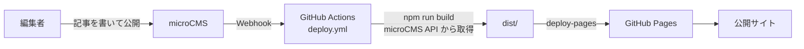

# microCMS 導入手順

CoderDojo 奈良サイトのコンテンツを microCMS から更新できるようにするための手順書です。
microCMS 側の設定と、このリポジトリ側の実装の両方をまとめています。

## 1. 概要

### 目的

現在このサイトのコンテンツは、すべてリポジトリ内のファイルとして管理されています。

- ブログ記事: `src/content/blog/**/*.md`
- 次回開催情報・スタッフ・FAQ・サポーター: `src/data/*.json`

更新するには Git の操作が必要で、エンジニア以外のメンバーが気軽に更新できません。
microCMS を導入して、ブラウザから更新できる状態にします。

このサイトが使う CMS は **microCMS ひとつ**です。以前このリポジトリには CloudCannon の設定が
入っていましたが、利用しないため削除済みです。

### 対象範囲

| コンテンツ     | 現在の場所                 | microCMS 化 |
| -------------- | -------------------------- | ----------- |
| ブログ記事     | `src/content/blog/**`      | ○           |
| 次回開催情報   | `src/data/nextEvent.json`  | ○           |
| スタッフ紹介   | `src/data/staff.json`      | ○           |
| よくあるご質問 | `src/data/faq.json`        | ○           |
| サポート企業   | `src/data/supporters.json` | ○           |
| 固定ページ     | `src/content/pages/**`     | ×（対象外） |
| サイト共通設定 | `src/data/seo.json` など   | ×（対象外） |

固定ページ（`src/content/pages`）は `pageSections` によるブロック構造で、
任意のコンポーネントを任意の順序・任意の入れ子で並べられます。
microCMS のカスタムフィールドで再現することは可能ですが実装コストが大きいため、今回は対象外とします。
固定ページは引き続き Markdown を Git で編集します。

### 基本方針

このサイトは GitHub Pages 上の**静的サイト**です。microCMS のコンテンツはビルド時に取得され、
HTML に焼き込まれます。したがって「microCMS で公開ボタンを押す → サイトに反映」の間に
**再ビルドが必要**です。この再ビルドを Webhook で自動化します。

設計上、次の 3 点を守ります。

1. **既存のファイルベースのコンテンツを消さない**
   ブログ記事 69 件を一括移行せず、既存の Markdown 記事と microCMS の記事を**マージ**して表示します。
   新しい記事から microCMS で書き始められ、途中で移行を止めても壊れません。

2. **API キーがなくてもビルドが通る**
   `MICROCMS_API_KEY` が未設定なら、既存の `src/data/*.json` とファイル記事だけでビルドします。
   API キーを持たないメンバーもローカルで開発できます。

3. **URL 構造を変えない**
   ブログ記事の URL は現行どおり `/YYYY/slug/` を維持します。既存記事の URL は変わりません。

## 2. 全体の流れ



反映までの目安は、Webhook 発火からビルド完了・配信まで **3〜5 分程度**です。
公開直後にサイトを見ても反映されていないのは正常なので、数分待ってから確認してください。

## 3. 事前準備

### 3-1. microCMS のサービスを作る

1. [microCMS](https://microcms.io/) でアカウントを作成する
2. サービスを新規作成する（サービス ID は例として `coderdojo-nara` とします）
   - このサービス ID が `MICROCMS_SERVICE_DOMAIN` の値になります
   - API のベース URL は `https://coderdojo-nara.microcms.io/api/v1/` になります
3. 料金プランを確認する
   - Hobby プラン（無料）で API 数 5 件まで。今回作る API はちょうど 5 件です
   - 将来 API を追加する予定があるなら、有料プランを検討してください

### 3-2. API キーを発行する

「サービス設定 → API キー」から、ビルド用の API キーを発行します。

| 項目         | 設定値                                       |
| ------------ | -------------------------------------------- |
| 名前         | `github-actions-build`                       |
| GET          | 有効（全 API）                               |
| その他の権限 | 無効（POST / PUT / PATCH / DELETE はすべて） |

ビルドは読み取りしかしないので、**GET だけ**にしてください。
デフォルトの API キーをそのまま使わず、用途ごとに分けて発行することをおすすめします。

### 3-3. 環境変数を設定する

#### ローカル開発

リポジトリのルートに `.env` を作ります（`.env` は `.gitignore` 済みです）。

```bash
MICROCMS_SERVICE_DOMAIN=coderdojo-nara
MICROCMS_API_KEY=（発行した API キー）
```

#### GitHub Actions

リポジトリの「Settings → Secrets and variables → Actions → New repository secret」から
次の 2 つを登録します。

| Secret 名                 | 値                |
| ------------------------- | ----------------- |
| `MICROCMS_SERVICE_DOMAIN` | `coderdojo-nara`  |
| `MICROCMS_API_KEY`        | 発行した API キー |

> **注意**: API キーはリポジトリにコミットしないでください。
> 誤ってコミットした場合の対応は「9. トラブルシューティング」を参照してください。

## 4. API スキーマ定義

microCMS の管理画面で 5 つの API を作成します。
以下の表の「フィールド ID」は、コード側が参照する名前なので**表記どおりに**設定してください。

### 4-1. `blog`（ブログ記事）

- API の ID: `blog`
- 型: **リスト形式**

| フィールド ID | 表示名         | 種類                       | 必須 | 説明・現行データとの対応                                          |
| ------------- | -------------- | -------------------------- | ---- | ----------------------------------------------------------------- |
| `slug`        | スラッグ       | テキストフィールド         | ○    | URL の末尾。半角英数とハイフンのみ。例: `minecraft-workshop`      |
| `title`       | タイトル       | テキストフィールド         | ○    | frontmatter の `title`                                            |
| `description` | 概要           | テキストエリア             |      | frontmatter の `description`。一覧の説明文・OGP・RSS に使う       |
| `date`        | 公開日         | 日時                       | ○    | frontmatter の `date`。**URL の年（`/YYYY/`）もこの値から決まる** |
| `author`      | 著者           | テキストフィールド         |      | 未入力なら `CoderDojo 奈良`                                       |
| `image`       | アイキャッチ   | 画像                       |      | frontmatter の `image`。記事冒頭とOGPに使われる                   |
| `tags`        | タグ           | テキストフィールド（複数） |      | frontmatter の `tags`                                             |
| `body`        | 本文           | **リッチエディタ**         | ○    | 記事本文                                                          |
| `gallery`     | 画像ギャラリー | 繰り返しフィールド         |      | frontmatter の `images`。本文の下に格子状で並ぶ                   |

`gallery` の繰り返しフィールドには、カスタムフィールド「ギャラリー画像」を作って割り当てます。

| フィールド ID | 表示名       | 種類               | 必須 |
| ------------- | ------------ | ------------------ | ---- |
| `url`         | 画像         | 画像               | ○    |
| `alt`         | 代替テキスト | テキストフィールド |      |

#### 本文にリッチエディタを使う理由

既存記事は Markdown ですが、microCMS 側は**リッチエディタ**にします。
Markdown を書けない人でも記事を書けることを優先しました。

リッチエディタは HTML を返すので、後述する loader で `rendered.html` にセットします。
これにより記事詳細ページ（`src/pages/[year]/[slug]/index.astro`）の
`render()` / `<Content />` を書き換えずに済みます。

なお `src/content/blog/2026/2026-04-04-minecraft-workshop.mdx` は MDX で
`Gallery` コンポーネントを使っており、microCMS では表現できません。
この記事はファイルのまま残します。

#### スラッグの命名ルール

`slug` は URL に直結し、**あとから変えるとリンクが切れます**。公開前に確定させてください。
既存記事とスラッグが重複しないよう注意します（重複した場合の挙動は Step 4 のコード参照）。

### 4-2. `next-event`（次回開催情報）

- API の ID: `next-event`
- 型: **オブジェクト形式**

| フィールド ID | 表示名      | 種類               | 必須 | 説明                                                        |
| ------------- | ----------- | ------------------ | ---- | ----------------------------------------------------------- |
| `date`        | 開催日      | テキストフィールド |      | 例: `12/13`。**空にすると「開催日未定」の表示に切り替わる** |
| `weekday`     | 曜日        | テキストフィールド |      | 例: `（土）`                                                |
| `time`        | 時間        | テキストフィールド |      | 例: `13:00〜16:00`                                          |
| `venue`       | 会場        | テキストエリア     |      | 改行がそのまま `<br>` になる                                |
| `applyUrl`    | 申し込みURL | テキストフィールド |      | connpass のイベント URL                                     |
| `badges`      | バッジ      | 繰り返しフィールド |      | 「参加費 無料」などの表示                                   |

`date` を空にすると、トップページ（`src/pages/index.astro`）は
「開催日未定」の案内表示に切り替わります。現行の `nextEvent.json` で `date: null` にするのと同じ挙動です。
**次回開催が未定になったら日付を消す**、という運用になります。

`badges` の繰り返しフィールドには、カスタムフィールド「バッジ」を作って割り当てます。

| フィールド ID | 表示名 | 種類               | 必須 | 説明                                         |
| ------------- | ------ | ------------------ | ---- | -------------------------------------------- |
| `label`       | ラベル | テキストフィールド | ○    | 例: `参加費 無料`                            |
| `variant`     | 種類   | セレクトフィールド | ○    | 選択肢: `success` / `info`（色が変わります） |

### 4-3. `staff`（スタッフ紹介）

- API の ID: `staff`
- 型: **リスト形式**

| フィールド ID | 表示名       | 種類               | 必須 | 説明                                                              |
| ------------- | ------------ | ------------------ | ---- | ----------------------------------------------------------------- |
| `name`        | 名前         | テキストフィールド | ○    |                                                                   |
| `address`     | 在住地       | テキストフィールド |      | 未入力なら非表示                                                  |
| `profile`     | プロフィール | テキストエリア     | ○    |                                                                   |
| `link`        | リンクURL    | テキストフィールド |      | 未入力ならボタン非表示                                            |
| `image`       | 顔写真       | 画像               |      |                                                                   |
| `order`       | 表示順       | 数値               | ○    | 小さいほど先。`10`, `20`, `30` と飛ばして振ると後から挿入しやすい |

### 4-4. `faq`（よくあるご質問）

- API の ID: `faq`
- 型: **リスト形式**

| フィールド ID | 表示名 | 種類               | 必須 | 説明                                         |
| ------------- | ------ | ------------------ | ---- | -------------------------------------------- |
| `question`    | 質問   | テキストフィールド | ○    |                                              |
| `answer`      | 回答   | **リッチエディタ** | ○    | 現行 JSON でもリンクを含む HTML を入れている |
| `order`       | 表示順 | 数値               | ○    | 小さいほど先                                 |

### 4-5. `supporters`（サポート企業）

- API の ID: `supporters`
- 型: **オブジェクト形式**

| フィールド ID | 表示名   | 種類               | 必須 | 説明                             |
| ------------- | -------- | ------------------ | ---- | -------------------------------- |
| `heading`     | 見出し   | テキストフィールド | ○    | 例: `サポート企業`               |
| `description` | 説明文   | テキストエリア     |      |                                  |
| `companies`   | 企業一覧 | 繰り返しフィールド | ○    | 0 件のときはセクションごと非表示 |

`companies` の繰り返しフィールドには、カスタムフィールド「サポート企業」を作って割り当てます。
並び順は管理画面での並び順がそのまま反映されます。

| フィールド ID | 表示名       | 種類               | 必須 | 説明                                     |
| ------------- | ------------ | ------------------ | ---- | ---------------------------------------- |
| `name`        | 企業名       | テキストフィールド | ○    |                                          |
| `url`         | サイトURL    | テキストフィールド | ○    |                                          |
| `logo`        | ロゴ画像     | 画像               | ○    | SVG も画像フィールドにアップロードできる |
| `alt`         | 代替テキスト | テキストフィールド |      | 未入力なら企業名を使う                   |

## 5. リポジトリ側の実装手順

Step 1〜2 は共通の土台、Step 3〜4 がブログ、Step 5 が `src/data` 系、Step 6 が CI です。
**ブログだけ先に導入して動作確認する**、という進め方ができます。

### Step 1: SDK の導入

```bash
npm install microcms-js-sdk
```

### Step 2: microCMS クライアントを作る

新規ファイル `src/lib/microcms.ts`:

```ts
import { createClient } from 'microcms-js-sdk';

// content.config.ts や loader は Node 上で実行されるため process.env を優先して読む。
// GitHub Actions では env: 経由で、ローカルでは .env 経由で渡ってくる。
const serviceDomain =
  process.env.MICROCMS_SERVICE_DOMAIN ?? import.meta.env.MICROCMS_SERVICE_DOMAIN;
const apiKey = process.env.MICROCMS_API_KEY ?? import.meta.env.MICROCMS_API_KEY;

/** microCMS の認証情報が揃っているか。未設定ならファイル・JSON のみでビルドする。 */
export const hasMicroCMS = Boolean(serviceDomain && apiKey);

export const microcms = hasMicroCMS ? createClient({ serviceDomain, apiKey }) : null;

/**
 * microCMS からの取得に失敗してもビルドを止めない。
 * API 障害やキーの期限切れでサイト全体がデプロイできなくなるのを避ける。
 */
export async function safeFetch<T>(label: string, fn: () => Promise<T>, fallback: T): Promise<T> {
  if (!microcms) return fallback;
  try {
    return await fn();
  } catch (error) {
    console.warn(`[microCMS] ${label} の取得に失敗したためフォールバックを使います:`, error);

    return fallback;
  }
}
```

> **判断ポイント**: 取得失敗時にビルドを落とすか、フォールバックで続けるか。
> ここでは「古い内容でも公開が続く」ほうを選んでいます。
> 「間違った内容を出すくらいなら落としたい」なら `safeFetch` を使わず throw させてください。

### Step 3: ブログの loader を追加する

`src/content.config.ts` に microCMS 用のコレクションを追加します。**既存の `blog` コレクションはそのまま残します。**

```ts
import { safeFetch, microcms } from './lib/microcms';
import type { Loader } from 'astro/loaders';

const cmsBlogSchema = z.object({
  slug: z.string(),
  title: z.string(),
  description: z.string().optional().default(''),
  date: z.coerce.date(),
  author: z.string().default('CoderDojo 奈良'),
  image: z.string().optional(),
  tags: z.array(z.string()).default([]),
  images: z
    .array(z.object({ url: z.string(), alt: z.string().default('') }))
    .optional()
    .default([]),
});

/**
 * microCMS の blog API を読み込む loader。
 * リッチエディタが返す HTML を rendered.html にセットすることで、
 * 記事詳細ページの render() / <Content /> をそのまま使える。
 */
const microcmsBlogLoader: Loader = {
  name: 'microcms-blog',
  load: async ({ store, parseData, generateDigest, logger }) => {
    store.clear();

    const posts = await safeFetch(
      'blog',
      () =>
        microcms!.getAllContents<{
          id: string;
          slug: string;
          title: string;
          description?: string;
          date: string;
          author?: string;
          image?: { url: string };
          tags?: string[];
          body: string;
          gallery?: { url: { url: string }; alt?: string }[];
        }>({ endpoint: 'blog' }),
      []
    );

    for (const post of posts) {
      const data = await parseData({
        id: post.slug,
        data: {
          slug: post.slug,
          title: post.title,
          description: post.description,
          date: post.date,
          author: post.author,
          image: post.image?.url,
          tags: post.tags,
          images: (post.gallery ?? []).map((g) => ({ url: g.url.url, alt: g.alt ?? '' })),
        },
      });

      store.set({
        id: post.slug,
        data,
        digest: generateDigest(post),
        rendered: { html: post.body },
      });
    }

    logger.info(`microCMS から ${posts.length} 件の記事を読み込みました`);
  },
};

const blogCmsCollection = defineCollection({
  loader: microcmsBlogLoader,
  schema: cmsBlogSchema,
});
```

`collections` に追加します。

```ts
export const collections = {
  pages: pagesCollection,
  'docs-pages': docsPagesCollection,
  'docs-components': docsComponentsCollection,
  blog: blogCollection,
  blogCms: blogCmsCollection, // 追加
};
```

### Step 4: ファイル記事と CMS 記事をマージする

`src/utils/blog.ts` を、両方のコレクションを扱える統合レイヤーに拡張します。
既存の 4 関数（`getPostSlug` / `getPostYear` / `getPostUrl` / `sortPostsByDateDesc`）は
ファイル記事専用なので、CMS 記事にも対応するよう分岐を足します。

```ts
import { getCollection, type CollectionEntry } from 'astro:content';

export type AnyPost = CollectionEntry<'blog'> | CollectionEntry<'blogCms'>;

/** CMS 記事は data.slug を持つ。ファイル記事は id からファイル名を取り出す。 */
export function getPostSlug(post: AnyPost): string {
  if ('slug' in post.data) return post.data.slug;
  const filename = post.id.split('/').pop() ?? post.id;

  return filename.replace(/^\d{4}-\d{2}-\d{2}-/, '');
}

// getPostYear / getPostUrl / sortPostsByDateDesc は AnyPost を受けるだけで
// 中身は現行のまま動く（いずれも data.date と getPostSlug しか見ていないため）。

/**
 * ファイル記事と microCMS 記事をマージして新しい順に返す。
 * スラッグが重複した場合は microCMS 側を優先する（移行途中の上書きを想定）。
 */
export async function getAllPosts(): Promise<AnyPost[]> {
  const [filePosts, cmsPosts] = await Promise.all([
    getCollection('blog'),
    getCollection('blogCms'),
  ]);

  const cmsSlugs = new Set(cmsPosts.map((p) => p.data.slug));
  const merged = [...cmsPosts, ...filePosts.filter((p) => !cmsSlugs.has(getPostSlug(p)))];

  return sortPostsByDateDesc(merged);
}
```

これを使うよう、ブログを読んでいる 3 ファイルを差し替えます。
いずれも `getCollection("blog")` を `getAllPosts()` に置き換えるだけです。

| ファイル                              | 変更内容                                                                                   |
| ------------------------------------- | ------------------------------------------------------------------------------------------ |
| `src/pages/blog/[...page].astro`      | `sortPostsByDateDesc(await getCollection("blog"))` → `await getAllPosts()`                 |
| `src/pages/[year]/[slug]/index.astro` | `getStaticPaths` の `getCollection("blog")` → `getAllPosts()`。`Props` の型を `AnyPost` に |
| `src/pages/feed.xml.ts`               | 同上                                                                                       |

記事詳細ページの `render(post)` と `<Content components={{ Gallery }} />` は変更不要です。
CMS 記事では `rendered.html`（リッチエディタの HTML）がそのまま描画されます。

### Step 5: `src/data` 系を microCMS 対応にする

JSON ファイルは**消さずに残し**、microCMS が使えるときだけそちらを優先するローダーを挟みます。

新規ファイル `src/data/loaders/nextEvent.ts`（他の 3 つも同じ形）:

```ts
import fallback from '../nextEvent.json';
import { microcms, safeFetch } from '@lib/microcms';
import type { NextEvent } from '../../types';

export async function getNextEvent(): Promise<NextEvent> {
  const cms = await safeFetch(
    'next-event',
    () => microcms!.getObject<NextEvent>({ endpoint: 'next-event' }),
    null
  );

  // microCMS 未設定・取得失敗時は既存 JSON にフォールバック
  return cms ?? (fallback as NextEvent);
}
```

各ページを差し替えます。

| ファイル                  | 現在                                               | 変更後                                     |
| ------------------------- | -------------------------------------------------- | ------------------------------------------ |
| `src/pages/index.astro:3` | `import nextEventData from "@data/nextEvent.json"` | `const nextEvent = await getNextEvent()`   |
| `src/pages/index.astro:5` | `import supporters from "@data/supporters.json"`   | `const supporters = await getSupporters()` |
| `src/pages/staff.astro:3` | `import staffData from "@data/staff.json"`         | `const staffData = await getStaff()`       |
| `src/pages/join.astro:3`  | `import faq from "@data/faq.json"`                 | `const faq = await getFaq()`               |

`astro.config.mjs` の `resolve.alias` に `@lib` を追加しておくと import が短くなります
（`@data` `@utils` などと同じ書式で `src/lib` を登録）。

`staff` と `faq` は `orders: "order"` を指定して取得し、`order` フィールドの昇順に並べます。
`supporters` の企業一覧は繰り返しフィールドなので、管理画面での並び順がそのまま反映されます。

#### 表示側で気をつける点

- 画像フィールドは `{ url, width, height }` のオブジェクトで返ります。`.url` を取り出してください
- `faq` の `answer` はリッチエディタの HTML です。現行どおり `set:html` で描画します
- microCMS の画像は `https://images.microcms-assets.io/...` から配信され、
  `?w=800&fm=webp` のようなクエリでリサイズ・変換できます。ロゴや顔写真には指定を推奨します

### Step 6: GitHub Actions を更新する

`.github/workflows/deploy.yml` を 2 か所変更します。

**トリガーに Webhook 用のイベントを追加**:

```yaml
on:
  push:
    branches:
      - main
  workflow_dispatch:
  repository_dispatch:
    types: [microcms-update]
```

**Build ステップに環境変数を渡す**:

```yaml
- name: Build
  run: npm run build
  env:
    MICROCMS_SERVICE_DOMAIN: ${{ secrets.MICROCMS_SERVICE_DOMAIN }}
    MICROCMS_API_KEY: ${{ secrets.MICROCMS_API_KEY }}
```

この 2 つを入れ忘れると、**ビルドは成功するのに内容が古いまま**になります。
Secrets が渡っていないと `hasMicroCMS` が false になり、フォールバックで JSON とファイル記事だけを
使ってしまうためです。

## 6. Webhook の設定

microCMS で公開ボタンを押したときに GitHub Actions を起動します。

### 6-1. GitHub のトークンを作る

1. GitHub の「Settings → Developer settings → Personal access tokens → Fine-grained tokens」
2. 「Generate new token」で作成
   - Repository access: `coderdojo-nara/coderdojo-nara.github.io` のみを選択
   - Permissions → Repository permissions → **Actions: Read and write**
   - Contents は Read のみ。それ以外の権限は付けない
   - 有効期限を設定した場合、**切れると更新が反映されなくなる**ので更新日をカレンダーに入れておく
3. 生成されたトークンを控える（画面を離れると二度と表示されません）

### 6-2. microCMS 側で Webhook を登録する

対象の API（`blog` / `next-event` / `staff` / `faq` / `supporters`）**それぞれ**で設定します。

「API 設定 → Webhook → 追加」から「GitHub Actions」を選び、次を入力します。

| 項目             | 設定値                     |
| ---------------- | -------------------------- |
| Owner            | `coderdojo-nara`           |
| Repository       | `coderdojo-nara.github.io` |
| Workflow file ID | `deploy.yml`               |
| Ref              | `main`                     |
| Access token     | 6-1 で作ったトークン       |

通知タイミングは、少なくとも「コンテンツの公開・更新・削除」を有効にします。
下書き保存のたびにビルドが走らないよう、下書き関連の通知はオフを推奨します。

> GitHub Actions プリセットが使えない場合は、汎用の Webhook で
> `https://api.github.com/repos/coderdojo-nara/coderdojo-nara.github.io/dispatches` に
> `{"event_type":"microcms-update"}` を POST する形でも同じことができます
> （Step 6 で `repository_dispatch` を追加済みです）。

### 6-3. 動作確認

1. microCMS でテスト記事を作って公開する
2. GitHub の Actions タブでワークフローが起動したことを確認する
3. 3〜5 分後にサイトを開き、記事が表示されることを確認する
4. 確認できたらテスト記事を削除し、削除でもビルドが走ることを確認する

## 7. 既存コンテンツの移行

### ブログ記事（69 件）

**原則、移行しません。** マージ方式にしているため、既存記事はファイルのままで問題なく表示されます。

一括移行にはコストとリスクがあります。

- Markdown → HTML への変換で、見出し・リンク・引用の崩れを 69 件分すべて目視確認する必要がある
- 記事内の画像は `/images/...`（`public/` 配下）を参照しており、そのまま使い続けるほうが安全
- MDX 記事（`Gallery` コンポーネント使用）は変換できない
- 移行ミスで URL が変わると、外部からのリンクや検索結果が切れる

将来どうしても移行する場合は、microCMS の Management API
（`https://{serviceDomain}.microcms-management.io/api/v1/contents/blog`）に
`markdown-it`（導入済み）で HTML 化した本文を POST するスクリプトを書きます。
その際も**一度に全件流さず、数件ずつ確認しながら**進めてください。

### `src/data/*.json`

件数が少ないので、管理画面から手で入力するのが確実です。
入力後、`.env` に API キーを設定してローカルでビルドし、**現行サイトと表示が一致するか**を
確認してから Secrets を設定してください。

JSON ファイルはフォールバックとして残します。microCMS 側を更新したら、
JSON との差が開いていくのは想定内です（フォールバックは非常時の保険と割り切る）。

### 画像の扱い

`public/images/` と microCMS のメディア（`images.microcms-assets.io`）は**併存**します。
既存画像を移す必要はありません。今後 microCMS から入稿する分だけメディアにアップロードします。

## 8. 運用ルール

### 何をどこで編集するか

| コンテンツ                  | 編集場所 | 備考                            |
| --------------------------- | -------- | ------------------------------- |
| 新しいブログ記事            | microCMS |                                 |
| 既存のブログ記事（移行前）  | Git      | microCMS には存在しない         |
| 次回開催情報                | microCMS | 開催未定なら `date` を空に      |
| スタッフ・FAQ・サポート企業 | microCMS |                                 |
| 固定ページ                  | Git      | `src/content/pages/**` の md    |
| ナビ・フッター・SEO 設定    | Git      | `src/data/mainNav.json` など    |
| デザイン・レイアウト        | Git      |                                 |

**同じコンテンツを 2 か所で編集しない**ことがいちばん大事です。
microCMS に移した項目は、対応する `src/data/*.json` やファイル記事を編集しても
上書きされて反映されません。移行が済んだものは microCMS を唯一の編集場所としてください。

### 下書きと公開予約

- **下書き**: microCMS の下書きはビルド時に取得されないため、サイトには出ません。
  静的サイトなので下書きプレビューは即時にはできません
  （必要になったら、プレビュー専用の SSR エンドポイントを別途用意する検討が必要です）
- **公開予約**: microCMS で公開日時を予約しても、**その時刻に自動でビルドは走りません**。
  予約公開を使うなら、GitHub Actions に定期実行（`schedule`）を足すか、
  公開時刻に手動で Actions を起動してください

### 反映されないときにまず見るところ

1. Actions タブでワークフローが起動しているか
2. 起動しているならビルドログに `microCMS から N 件の記事を読み込みました` が出ているか
3. 出ていない場合は Secrets の設定漏れを疑う

## 9. トラブルシューティング

### ビルドは成功するのに内容が古い

`MICROCMS_SERVICE_DOMAIN` / `MICROCMS_API_KEY` が Build ステップに渡っていない可能性が高いです。
Step 6 の `env:` の追加と、リポジトリ Secrets の登録を確認してください。
`hasMicroCMS` が false のときはフォールバックが使われ、**エラーにならず古い内容で成功します**。

### microCMS で公開してもビルドが走らない

- Webhook が対象の API に設定されているか（API ごとに設定が必要）
- GitHub のトークンが期限切れになっていないか
- トークンに Actions: Read and write があるか
- microCMS の Webhook 設定画面に送信履歴とレスポンスが残るので、そこで失敗理由を確認する

### 記事が 10 件しか出ない

microCMS の API はデフォルトで 10 件しか返しません。
`getAllContents`（全件取得）を使っているか確認してください。`getList` を使う場合は
`limit` の最大が 100 なので、100 件を超えたらページングが必要です。

### 記事の URL が想定と違う

URL は `/{date の年}/{slug}/` です。`date` の年と `slug` を確認してください。
`slug` を後から変えると URL が変わり、既存リンクが切れます。

### API キーを誤ってコミットした

1. **すぐに microCMS 管理画面でその API キーを削除**する（履歴から消すより先に）
2. 新しい API キーを発行し、GitHub Secrets と `.env` を更新する
3. 必要に応じて Git 履歴から除去する

キーが漏れても GET 権限だけなら被害は「非公開コンテンツの閲覧」に限られますが、
必ず失効させてください。

### ローカルで microCMS の内容を確認したい

`.env` に API キーを設定して `npm run dev` を実行します。
Content Layer はキャッシュされるので、microCMS 側を更新しても反映されない場合は
`.astro/` を削除してから再起動してください。

## 参考リンク

- [microCMS ドキュメント](https://document.microcms.io/)
- [microCMS JavaScript SDK](https://github.com/microcmsio/microcms-js-sdk)
- [Astro Content Loader API](https://docs.astro.build/en/reference/content-loader-reference/)
